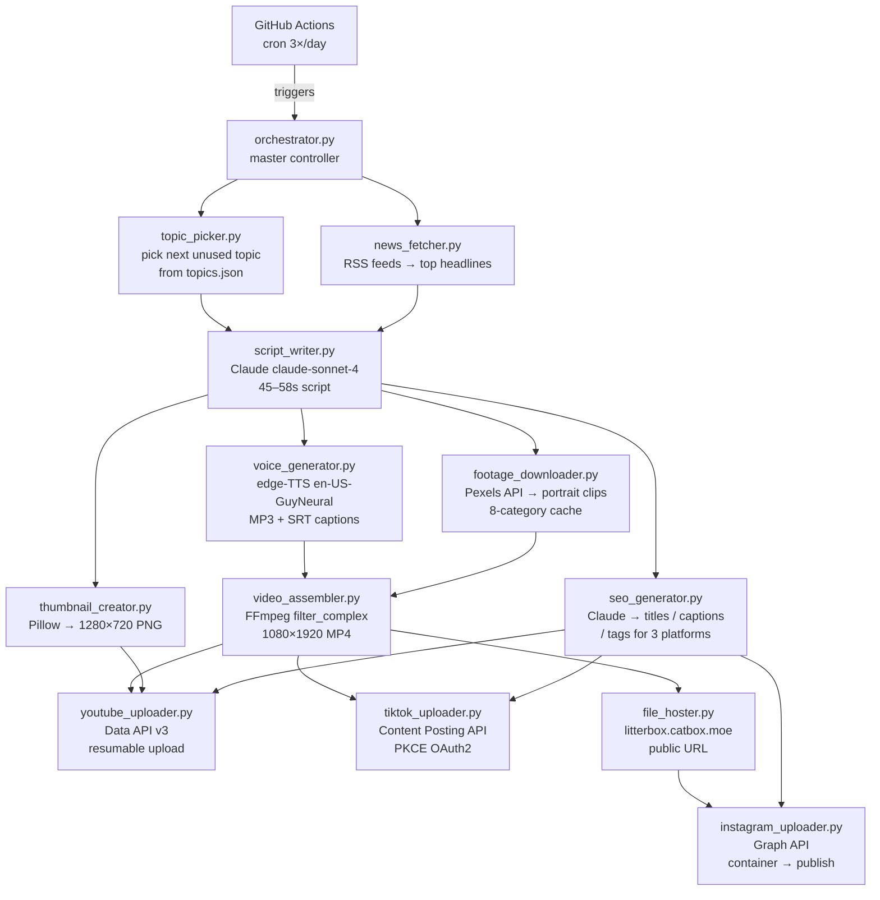

# CipherPulse

**The Heartbeat of Digital Threats** — a fully automated pipeline that produces cybersecurity & AI Shorts and publishes them to YouTube Shorts, TikTok, and Instagram Reels three times a day, at zero cost beyond the Anthropic API (~$2–3/month).

---

## Architecture



---

## Features

- **Zero-touch production** — one GitHub Actions cron trigger → finished video live on 3 platforms
- **500 pre-seeded topics** across 6 content formats (F1 Incident, F2 AI Reveal, F3 Myth Buster, F4 How It Works, F5 List, F6 News React)
- **Live news injection** — top cybersecurity headlines pulled fresh from 6 RSS feeds (The Hacker News, BleepingComputer, Krebs on Security, CISA, Ars Technica, MIT Tech Review)
- **CipherPulse brand** — dark `#06060A` background, `#00F2EA` cyan accents, Bebas Neue + Oswald fonts
- **No platform watermarks** — original Pexels stock footage only, portrait-first search
- **Resumable uploads** — exponential backoff retry on all API calls
- **Platform gating** — TikTok and Instagram disabled by default; flip a flag in `config/platforms.json`

---

## Tech Stack

| Layer | Technology |
|---|---|
| Script generation | Anthropic API (`claude-sonnet-4-20250514`) |
| Text-to-speech | edge-TTS (`en-US-GuyNeural`, rate=-8%, pitch=-3Hz) |
| Subtitle timing | SentenceBoundary events → proportional word derivation |
| Stock footage | Pexels Video API (8-category cache) |
| Video assembly | FFmpeg filter_complex — scale+crop, libass subtitles, amix |
| Thumbnail | Pillow (4-layer RGBA composite) |
| YouTube upload | YouTube Data API v3 — OAuth2, resumable MediaFileUpload |
| TikTok upload | Content Posting API — PKCE OAuth2, chunk PUT |
| Instagram upload | Graph API — container/publish flow, 60-day token |
| File hosting | litterbox.catbox.moe (72h TTL) |
| Automation | GitHub Actions (3× daily cron + hourly publish queue) |
| Retries | tenacity (exponential backoff) |

---

## Quick Start

### 1. Clone and install

```bash
git clone https://github.com/YOUR_USERNAME/CipherPulse.git
cd CipherPulse
pip install -r requirements.txt
```

### 2. Configure environment

```bash
cp .env.example .env
# Edit .env and fill in your API keys
```

Required keys:

| Variable | Where to get it |
|---|---|
| `ANTHROPIC_API_KEY` | [console.anthropic.com](https://console.anthropic.com) |
| `PEXELS_API_KEY` | [pexels.com/api](https://www.pexels.com/api/) |
| `YOUTUBE_CLIENT_ID` | Google Cloud Console → Credentials → OAuth 2.0 |
| `YOUTUBE_CLIENT_SECRET` | same as above |
| `TIKTOK_CLIENT_KEY` | [developers.tiktok.com](https://developers.tiktok.com) (optional) |
| `TIKTOK_CLIENT_SECRET` | same as above (optional) |
| `INSTAGRAM_ACCESS_TOKEN` | Facebook Developer App → Graph API Explorer (optional) |
| `INSTAGRAM_ACCOUNT_ID` | same as above (optional) |

### 3. Authenticate YouTube

Run once locally to complete the OAuth2 browser flow:

```bash
python3 -m src.youtube_uploader --auth-only
```

A `config/token.json` is saved. Base64-encode it for GitHub Actions:

```bash
base64 -w 0 config/token.json
# paste output as YOUTUBE_TOKEN_B64 secret in GitHub
```

### 4. Test the pipeline

```bash
# Full dry-run (no real uploads, uses real Claude + Pexels)
python3 -m src.orchestrator --dry-run

# Produce 1 real Short and upload to YouTube
python3 -m src.orchestrator

# Produce 3 Shorts
python3 -m src.orchestrator --count 3
```

### 5. Enable TikTok / Instagram (optional)

Edit `config/platforms.json`:

```json
{
  "tiktok":    {"enabled": true},
  "instagram": {"enabled": true}
}
```

Then authenticate each platform once:

```bash
# TikTok — opens browser for PKCE OAuth2
python3 -m src.tiktok_uploader --auth-only

# Instagram — paste your long-lived Graph API token
python3 -m src.instagram_uploader --auth-instructions
python3 -m src.instagram_uploader --save-token YOUR_TOKEN
```

### 6. Deploy to GitHub Actions

Push to GitHub and add all secrets under `Settings → Secrets → Actions`. The workflows run automatically on schedule.

To download generated videos: `Actions → Generate Shorts → Artifacts → cipherpulse-shorts-*`

---

## Module Reference

| Module | Description |
|---|---|
| `src/orchestrator.py` | Master controller — wires all modules, manages run_log.json |
| `src/topic_picker.py` | Picks next unused topic from topics.json; auto-resets when exhausted |
| `src/news_fetcher.py` | Pulls headlines from 6 RSS feeds; filters stale / duplicate |
| `src/script_writer.py` | Claude-powered 45–58s script with visual cue tags |
| `src/voice_generator.py` | edge-TTS voiceover + SRT subtitle file |
| `src/footage_downloader.py` | Pexels portrait clips with 8-category fallback cache |
| `src/video_assembler.py` | FFmpeg 1080×1920 MP4 with subtitles + background music |
| `src/thumbnail_creator.py` | Branded 1280×720 thumbnail via Pillow |
| `src/seo_generator.py` | Claude-generated titles, descriptions, tags for 3 platforms |
| `src/youtube_uploader.py` | OAuth2 resumable upload with scheduling support |
| `src/tiktok_uploader.py` | PKCE two-phase upload + schedule_queue.json |
| `src/file_hoster.py` | Upload MP4 to litterbox.catbox.moe for Instagram |
| `src/instagram_uploader.py` | Graph API container/publish Reels workflow |

---

## Project Structure

```
CipherPulse/
├── src/                    # Pipeline modules
├── config/
│   ├── platforms.json      # Enable/disable TikTok, Instagram
│   ├── token.json          # YouTube OAuth2 token (gitignored)
│   ├── tiktok_token.json   # TikTok token (gitignored)
│   └── instagram_token.json  # Instagram token (gitignored)
├── output/                 # Generated videos (gitignored)
│   ├── run_log.json        # History of all pipeline runs
│   └── YYYYMMDD_HHMMSS/   # One directory per Short
│       ├── video.mp4
│       ├── thumbnail.png
│       ├── script.txt
│       ├── voiceover.mp3
│       ├── subtitles.srt
│       └── metadata.json
├── assets/
│   ├── footage_cache/      # Pexels clips (gitignored)
│   └── music/              # Background music tracks (add your own)
├── topics.json             # 500 pre-seeded video topics
├── .github/workflows/
│   ├── generate-shorts.yml     # 3× daily production cron
│   └── publish-scheduled.yml   # Hourly TikTok queue flush
├── Dockerfile
└── requirements.txt
```

---

## Adding Background Music

Place royalty-free MP3 tracks in `assets/music/`. The assembler picks one at random per video and mixes it at 17% volume under the voiceover. Good sources: [Free Music Archive](https://freemusicarchive.org), [ccMixter](https://ccmixter.org), YouTube Audio Library.

---

## Cost Estimate

| Service | Usage | Monthly cost |
|---|---|---|
| Anthropic API | ~90 calls/month (3/day × 30) | ~$2–3 |
| Pexels API | Free tier (200 req/hour) | $0 |
| YouTube Data API | ~1,600 units/upload, 10,000 free/day | $0 |
| TikTok API | Free tier | $0 |
| GitHub Actions | 2,000 free minutes/month | $0 |
| litterbox.catbox.moe | Free | $0 |

**Total: ~$2–3/month**

---

## License

MIT
